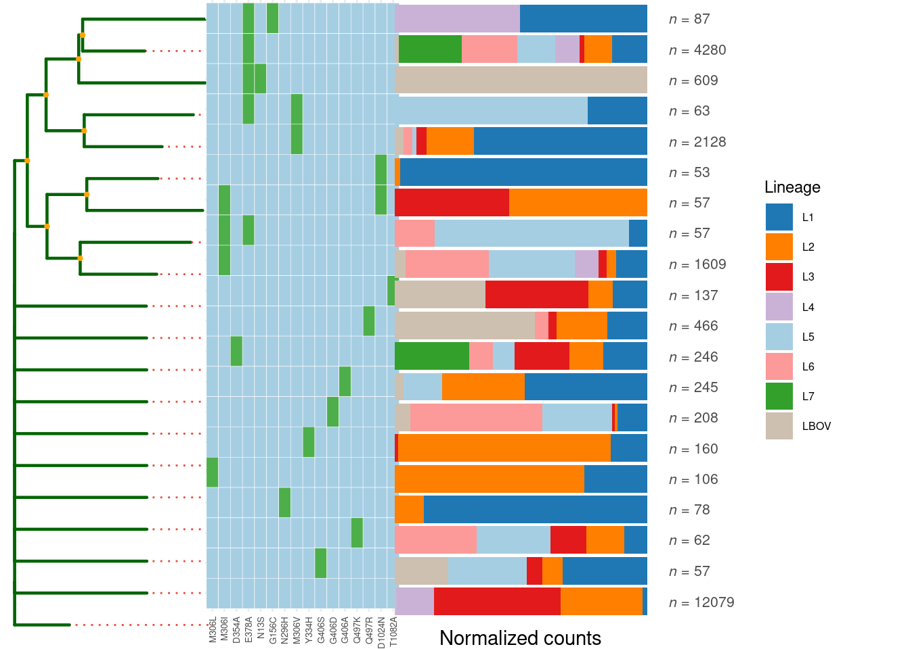
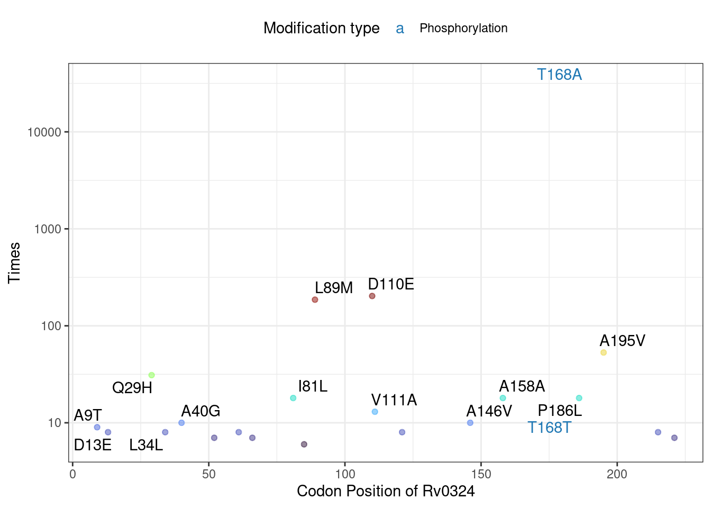

# About

With the widespread application of whole-genome sequencing (WGS) technologies, genomic data for pathogenic bacteria are rapidly expanding. Mutation detection based on reference genomes enables the rapid identification of adaptive mutations (e.g., drug resistance mutations, antigenic variations). While several studies have successfully identified genes under positive selection using public genomic datasets (@liu2022resilience), the lack of a unified framework for storing and analyzing bacterial mutation data hinders efficient data reuse.

Here we developed **qMut**, the R package designed for storage and rapid analysis of pathogenic bacterial mutations. This tutorial demonstrates its functionality using mutation data from more than 50000 *Mycobacterium tuberculosis* genomes.

# **Install and Loading package**
It is easy to install **qMut** from github:

``` r
# Install from GitHub
# devtools::install_github("HongxiangXu/qMut")

# Load required packages
library(qMut)        # our package
library(qs)          # read and save data faster
library(data.table)  
library(tidyverse)   
```

# Data Integration

## Input Requirements

The package accepts mutation data in either CSV format(produced by snippy) or standard VCF format. A minimal input should contain these columns:

``` r
exp_data <- read.csv("example/snippy_data/snps.csv")

head(exp_data,n=3)
```

```
##       CHROM  POS TYPE REF ALT EVIDENCE FTYPE STRAND   NT_POS  AA_POS
## 1 NC_000962 1718  snp   C   A A:20 C:0                              
## 2 NC_000962 1977  snp   A   G G:20 A:0                              
## 3 NC_000962 2532  snp   T   C C:20 T:0   CDS      + 481/1209 161/402
##                                    EFFECT LOCUS_TAG GENE
## 1                                                       
## 2                                                       
## 3 synonymous_variant c.481T>C p.Leu161Leu    Rv0002 dnaN
##                           PRODUCT
## 1                                
## 2                                
## 3 DNA polymerase III subunit beta
```

The `snp_file_list` contains mutation information identified by the snippy software. A standard mutation file should include the following 14 columns:

| Column      | Description                        |
|-------------|------------------------------------|
| `CHROM`     | Chromosome identifier              |
| `POS`       | Genomic position of the mutation   |
| `TYPE`      | Mutation type (SNP, INDEL, etc.)   |
| `REF`       | Reference allele                   |
| `ALT`       | Alternate allele                   |
| `EVIDENCE`  | Read depth supporting the mutation |
| `FTYPE`     | Functional type of mutation        |
| `STRAND`    | Coding strand (+/-)                |
| `NT_POS`    | Nucleotide position within gene    |
| `AA_POS`    | Amino acid position in protein     |
| `EFFECT`    | Functional consequence             |
| `LOCUS_TAG` | Gene locus identifier              |
| `GENE`      | Gene name                          |
| `PRODUCT`   | Protein product description        |

Mutation matrices are typically represented as binary (0/1) indicators denoting absence/presence/ of mutations across samples. Three key observations motivate our storage approach:

1.  **Sparsity**: Most mutations occur in only a few samples.
2.  **Annotation redundancy**: Many mutation types are identical across samples.
3.  **Scalability**: Whole-genome datasets can be extremely large.

We therefore decompose the data into two components:

1.  **snp_anno**: Stores the union of all mutation annotations (shared across samples)
2.  **snp_data**: Stores the sparse binary matrix of mutation occurrences

This decomposition provides significant advantages:

-   Reduced storage requirements (Each unique annotations stored once)
-   Faster matrix operations on sparse data
-   Efficient memory usage during analysis


``` r
# Demo to provide snp files and sample names for integration and production of 
# snp_anno and snp_data
snp_file_list <- list.files("example",recursive =T, full.names = T)
all_smp_name <- str_extract(snp_file_list,"(?<=snippy_data/)[^/]+")

IntegrateData(
  file_path = snp_file_list,
  smp_name = all_smp_name,
  output_dir = "output",
  chunk_size = 1000,  # Process in chunks of 1000 samples to reduce memory usage
  nworkers = 4        # Parallel processing
)
```

The **IntegrateData** function generates two files:snp_anno and snp_data, as mentioned above.

For large-scale analyses (\>10,000 samples), we recommend processing in chunks (set chunk_size appropriately).

This approach has been tested with \>50,000 bacterial genomes while maintaining memory efficiency.

Now, we directly use **snp_anno** and **snp_data** files produced by `IntegrateData` function to construct the SNPObject.

``` r
# read in snp_anno, qread is from qs package
snp_anno <- qread("example/snp_anno.qs",nthreads = 8)

# edit Mtb gene names to make it more readable (optional). 
snp_anno$LOCUS_TAG <- gsub("VBD_","v",snp_anno$LOCUS_TAG)
snp_anno$GENE <- ifelse(str_detect(snp_anno$GENE,"RVBD_RS"),snp_anno$LOCUS_TAG,snp_anno$GENE)

head(snp_anno)
```

```
##             CHROM POS TYPE FTYPE STRAND  NT_POS AA_POS
## A8Csnp  NC_018143   8  snp   CDS      +  8/1524  3/507
## G10Csnp NC_018143  10  snp   CDS      + 10/1524  4/507
## A11Csnp NC_018143  11  snp   CDS      + 11/1524  4/507
## C12Tsnp NC_018143  12  snp   CDS      + 12/1524  4/507
## C15Tsnp NC_018143  15  snp   CDS      + 15/1524  5/507
## G16Csnp NC_018143  16  snp   CDS      + 16/1524  6/507
##                                       EFFECT LOCUS_TAG_NEW GENE
## A8Csnp     missense_variant c.8A>C p.Asp3Ala  RVBD_RS00005 dnaA
## G10Csnp   missense_variant c.10G>C p.Asp4His  RVBD_RS00005 dnaA
## A11Csnp   missense_variant c.11A>C p.Asp4Ala  RVBD_RS00005 dnaA
## C12Tsnp synonymous_variant c.12C>T p.Asp4Asp  RVBD_RS00005 dnaA
## C15Tsnp synonymous_variant c.15C>T p.Pro5Pro  RVBD_RS00005 dnaA
## G16Csnp   missense_variant c.16G>C p.Gly6Arg  RVBD_RS00005 dnaA
##                                                PRODUCT AA_effect_short
## A8Csnp  chromosomal replication initiator protein DnaA             D3A
## G10Csnp chromosomal replication initiator protein DnaA             D4H
## A11Csnp chromosomal replication initiator protein DnaA             D4A
## C12Tsnp chromosomal replication initiator protein DnaA             D4D
## C15Tsnp chromosomal replication initiator protein DnaA             P5P
## G16Csnp chromosomal replication initiator protein DnaA             G6R
##         LOCUS_TAG
## A8Csnp     Rv0001
## G10Csnp    Rv0001
## A11Csnp    Rv0001
## C12Tsnp    Rv0001
## C15Tsnp    Rv0001
## G16Csnp    Rv0001
```

``` r
# read in snp_data
snp_data <- qread("example/snp_data.qs",nthreads = 8)

# snp_data is a large sparse matrix, with over 50000 rows(samples) and >700k 
# non-redundant mutations.
snp_data[1:6,1:6]
```

```
## 6 x 6 sparse Matrix of class "dgCMatrix"
##           A8Csnp G10Csnp A11Csnp C12Tsnp C15Tsnp G16Csnp
## DRR034340      .       .       .       .       .       .
## DRR034341      .       .       .       .       .       .
## DRR034342      .       .       .       .       1       .
## DRR034343      .       .       .       .       .       .
## DRR034344      .       .       .       .       .       .
## DRR034345      .       .       .       .       .       .
```

## Creating the SNP Object


``` r
# Be careful! The first column of metadata must named as Sample_name.
sample_info <- fread("example/sample_info.txt",data.table = F) %>%
  filter(ID %in% rownames(snp_data)) %>%
  dplyr::rename(Sample_name=ID) %>% 
  mutate(Lineage=paste0("L",str_extract(Lineage,"(?<=LINEAGE).+")))

head(sample_info)
```

```
##   Sample_name Genome_coverage Sequencing_depth Lineage     Sublineage BioPrject
## 1   DRR034340        0.976338          52.9203      L2   lineage2.2.1 PRJDB3875
## 2   DRR034341        0.971547          36.7679      L2   lineage2.2.1 PRJDB3875
## 3   DRR034342        0.981057          40.2434      L4 lineage4.9.x.x PRJDB3875
## 4   DRR034343        0.977891          62.5146      L2   lineage2.2.1 PRJDB3875
## 5   DRR034344        0.982537          48.4552      L4 lineage4.9.x.x PRJDB3875
## 6   DRR034345        0.976601          42.5142      L4     lineage4.5 PRJDB3875
```


``` r
# Create the object
Mtb_mut <- CreateSNPObj(snp_anno = snp_anno,
                        snp_data = snp_data,
                        metadata = sample_info,
                        remove_genes_dt = "Mtb", # remove genes for Mtb(including PE/PPE,phage seq,etc)
                        verbose=T) # show the progress
```

```
## [1/2] Remove selected genes
```

```
## [2/2] Annotate amino acid changes
```

The qMut package utilizes R6 objects that contain multiple accessible attributes and methods for comprehensive mutation analysis; we will show them in next chapter.

## Merging Objects for Expanded Analysis

When incorporating new samples, the MergeData() function enables seamless integration of multiple qMut objects.


``` r
obj_merged <- MergeData(list(obj_old,obj_new))
```

# Mutation Screening and Analysis

The `Mtb_mut` object serves as the primary data structure for all downstream analyses in our package. We provide pre-processed qs objects for several common bacterial species:


``` r
# Load the pre-built Mycobacterium tuberculosis mutation object
Mtb_mut <- qread("example/Mtb_mut_obj.qs")

# We can see Mtb_mut S6 object contains a comprehensive set of attributes and methods designed for efficient mutation analysis.
Mtb_mut
```

```
## <Mutation Object>
##   Public:
##     calculate_NJ: function (num_thread = 1, snp_range = c(0.05, 0.95)) 
##     clone: function (deep = FALSE) 
##     estimate_imp: function (gene, gene_type = "GENE", metadata_col = NULL, upstream_length = NULL) 
##     estimate_imp_all: function () 
##     Evolution_dt: function (x) 
##     filter_sample: function (sample_name = NULL, mutation_index = NULL, opposite = F) 
##     filter_snp: function (gene, gene_type = "INDEX", upstream_length = NULL) 
##     get_metadata: function () 
##     initialize: function (snp_anno, snp_data, metadata = NULL, remove_genes_dt = NA, 
##     metadata: data.frame
##     ML_data_dt: function (selected_pheno) 
##     modification_info: list
##     MutNumPlot: function (locus_tag, limit = 1, label_num = 10, show_synomonous = T, 
##     MutTree: function (locus_tag, limit = 5, size = 20, metadata_col = NULL) 
##     nj_distance: NA
##     snp_list: list
##   Private:
##     initial_sample: NA
```

## Basic Mutation Statistics


``` r
# Calculate occurrence frequency for all mutations
all_mut <- Mtb_mut$estimate_imp("all")

head(all_mut)
```

```
##             CHROM POS TYPE FTYPE STRAND  NT_POS AA_POS
## A8Csnp  NC_018143   8  snp   CDS      +  8/1524  3/507
## G10Csnp NC_018143  10  snp   CDS      + 10/1524  4/507
## A11Csnp NC_018143  11  snp   CDS      + 11/1524  4/507
## C12Tsnp NC_018143  12  snp   CDS      + 12/1524  4/507
## C15Tsnp NC_018143  15  snp   CDS      + 15/1524  5/507
## G16Csnp NC_018143  16  snp   CDS      + 16/1524  6/507
##                                       EFFECT LOCUS_TAG_NEW GENE
## A8Csnp     missense_variant c.8A>C p.Asp3Ala  RVBD_RS00005 dnaA
## G10Csnp   missense_variant c.10G>C p.Asp4His  RVBD_RS00005 dnaA
## A11Csnp   missense_variant c.11A>C p.Asp4Ala  RVBD_RS00005 dnaA
## C12Tsnp synonymous_variant c.12C>T p.Asp4Asp  RVBD_RS00005 dnaA
## C15Tsnp synonymous_variant c.15C>T p.Pro5Pro  RVBD_RS00005 dnaA
## G16Csnp   missense_variant c.16G>C p.Gly6Arg  RVBD_RS00005 dnaA
##                                                PRODUCT AA_effect_short
## A8Csnp  chromosomal replication initiator protein DnaA             D3A
## G10Csnp chromosomal replication initiator protein DnaA             D4H
## A11Csnp chromosomal replication initiator protein DnaA             D4A
## C12Tsnp chromosomal replication initiator protein DnaA             D4D
## C15Tsnp chromosomal replication initiator protein DnaA             P5P
## G16Csnp chromosomal replication initiator protein DnaA             G6R
##         LOCUS_TAG   INDEX Acetylation Phosphorylation Times
## A8Csnp     Rv0001  A8Csnp          NA              NA     2
## G10Csnp    Rv0001 G10Csnp          NA              NA     1
## A11Csnp    Rv0001 A11Csnp          NA              NA    28
## C12Tsnp    Rv0001 C12Tsnp          NA              NA     1
## C15Tsnp    Rv0001 C15Tsnp          NA              NA     2
## G16Csnp    Rv0001 G16Csnp          NA              NA     1
```

``` r
# Analyze mutations in Rv0324 (default: coding sequence only)
Rv0324_mut <- Mtb_mut$estimate_imp("Rv0324", gene_type = "LOCUS_TAG")
```

```
## filter genes
```

```
## remain 51181 sample and 191 snps
```

``` r
# Now you can see the total occurance time of each mutations in Rv0324 for the Mtb_mut

head(Rv0324_mut)
```

```
##                 CHROM    POS TYPE FTYPE STRAND NT_POS AA_POS
## A391352Tsnp NC_018143 391352  snp   CDS      +  1/681  1/226
## G391354Csnp NC_018143 391354  snp   CDS      +  3/681  1/226
## G391355Asnp NC_018143 391355  snp   CDS      +  4/681  2/226
## C391356Asnp NC_018143 391356  snp   CDS      +  5/681  2/226
## G391359Asnp NC_018143 391359  snp   CDS      +  8/681  3/226
## C391365Tsnp NC_018143 391365  snp   CDS      + 14/681  5/226
##                                             EFFECT LOCUS_TAG_NEW   GENE
## A391352Tsnp initiator_codon_variant c.1A>T p.Met1?  RVBD_RS01710 Rv0324
## G391354Csnp initiator_codon_variant c.3G>C p.Met1?  RVBD_RS01710 Rv0324
## G391355Asnp      missense_variant c.4G>A p.Ala2Thr  RVBD_RS01710 Rv0324
## C391356Asnp      missense_variant c.5C>A p.Ala2Asp  RVBD_RS01710 Rv0324
## G391359Asnp      missense_variant c.8G>A p.Gly3Glu  RVBD_RS01710 Rv0324
## C391365Tsnp     missense_variant c.14C>T p.Ser5Phe  RVBD_RS01710 Rv0324
##                                                            PRODUCT
## A391352Tsnp metalloregulator ArsR/SmtB family transcription factor
## G391354Csnp metalloregulator ArsR/SmtB family transcription factor
## G391355Asnp metalloregulator ArsR/SmtB family transcription factor
## C391356Asnp metalloregulator ArsR/SmtB family transcription factor
## G391359Asnp metalloregulator ArsR/SmtB family transcription factor
## C391365Tsnp metalloregulator ArsR/SmtB family transcription factor
##             AA_effect_short LOCUS_TAG       INDEX Acetylation Phosphorylation
## A391352Tsnp             M1?    Rv0324 A391352Tsnp          NA              NA
## G391354Csnp             M1?    Rv0324 G391354Csnp          NA              NA
## G391355Asnp             A2T    Rv0324 G391355Asnp          NA              NA
## C391356Asnp             A2D    Rv0324 C391356Asnp          NA              NA
## G391359Asnp             G3E    Rv0324 G391359Asnp          NA              NA
## C391365Tsnp             S5F    Rv0324 C391365Tsnp          NA              NA
##             Times
## A391352Tsnp     1
## G391354Csnp     4
## G391355Asnp     1
## C391356Asnp     1
## G391359Asnp     1
## C391365Tsnp     1
```

``` r
## Include 300bp upstream regulatory region
Rv0324_mut <- Mtb_mut$estimate_imp(gene = "Rv0324",
                                   gene_type = "LOCUS_TAG",
                                   upstream_length = 300)
```

```
## filter genes
```

```
## remain 51181 sample and 293 snps
```
You should keep in mind that this statistical result will dynamically update alongside changes in the object. For example, if you filter the dataset to isolate strains with specific drug-resistance mutations and generate a new object, the statistics will then reflect the mutation status of Rv0324 exclusively within those drug-resistant strains. 

## katG Mutation Analysis (Isoniazid Resistance)
We will now demonstrate the basic usage of this object through a katG mutation analysis. This project begins by filtering Mycobacterium tuberculosis strains containing the classic isoniazid resistance mutation katG R463L. It then calculates lineage-specific differences in all katG mutations between R463L strains and wild-type (WT) strains. Additionally, we assess whether each mutation in embB (the ethambutol resistance gene) shows statistically significant differences in prevalence between R463L and WT strain group

``` r
# Identify all katG mutations
katG_mut <- Mtb_mut$estimate_imp("katG", gene_type = "GENE")
```

```
## filter genes
```

```
## remain 51181 sample and 1271 snps
```

``` r
# Filter strains with R463L variant (a common INH resistance mutation)
katG_R463L_index <- katG_mut %>% 
  filter(AA_effect_short == "R463L") %>% 
  pull(INDEX)

# filter_sample function will keep samples with katG_R463L mutation.
katG_R463L <- Mtb_mut$filter_sample(mutation_index = katG_R463L_index)
```

```
## remain 24610 sample and 1293186 snps
```

``` r
# To examine how katG mutations are distributed across different bacterial 
# lineages, we can perform lineage-specific frequency calculations 
# statistically:
Mtb_mut$estimate_imp("katG",gene_type = "GENE",metadata_col = "Lineage") %>% 
  filter(INDEX %in% katG_R463L_index)
```

```
## filter genes
```

```
## remain 51181 sample and 1271 snps
```

```
## calculate mutation frequency
```

```
##                          CHROM     POS    TYPE FTYPE STRAND    NT_POS  AA_POS
## C2154731Asnp         NC_018143 2154731     snp   CDS      - 1388/2223 463/740
## CGG2154731AGTcomplex NC_018143 2154731 complex   CDS      - 1388/2223 462/740
## CG2154731AAcomplex   NC_018143 2154731 complex   CDS      - 1388/2223 463/740
## CGG2154731AGAcomplex NC_018143 2154731 complex   CDS      - 1388/2223 462/740
##                                                                    EFFECT
## C2154731Asnp                       missense_variant c.1388G>T p.Arg463Leu
## CGG2154731AGTcomplex missense_variant c.1386_1388delCCGinsACT p.Arg463Leu
## CG2154731AAcomplex     missense_variant c.1387_1388delCGinsTT p.Arg463Leu
## CGG2154731AGAcomplex missense_variant c.1386_1388delCCGinsTCT p.Arg463Leu
##                      LOCUS_TAG_NEW GENE                 PRODUCT AA_effect_short
## C2154731Asnp          RVBD_RS10020 katG catalase/peroxidase HPI           R463L
## CGG2154731AGTcomplex  RVBD_RS10020 katG catalase/peroxidase HPI           R463L
## CG2154731AAcomplex    RVBD_RS10020 katG catalase/peroxidase HPI           R463L
## CGG2154731AGAcomplex  RVBD_RS10020 katG catalase/peroxidase HPI           R463L
##                      LOCUS_TAG                INDEX Acetylation Phosphorylation
## C2154731Asnp           Rv1908c         C2154731Asnp          NA              NA
## CGG2154731AGTcomplex   Rv1908c CGG2154731AGTcomplex          NA              NA
## CG2154731AAcomplex     Rv1908c   CG2154731AAcomplex          NA              NA
## CGG2154731AGAcomplex   Rv1908c CGG2154731AGAcomplex          NA              NA
##                      percents_L2 percents_L4 percents_L1 percents_L3
## C2154731Asnp             0.98083      0.0021     0.98321      0.9801
## CGG2154731AGTcomplex     0.00007      0.0000     0.00000      0.0000
## CG2154731AAcomplex       0.00007      0.0000     0.00000      0.0000
## CGG2154731AGAcomplex     0.00007      0.0000     0.00000      0.0000
##                      percents_L5 percents_L6 percents_LBOV percents_L7
## C2154731Asnp             0.99448     0.98795         0.995     0.98113
## CGG2154731AGTcomplex     0.00000     0.00000         0.000     0.00000
## CG2154731AAcomplex       0.00000     0.00000         0.000     0.00000
## CGG2154731AGAcomplex     0.00000     0.00000         0.000     0.00000
```

``` r
# Analysis of Drug Resistance Mutation Co-occurrence Patterns
# Comparative Analysis of embB Mutations in katG R463L Strains vs. WT Strains
embB_compare <- Mtb_mut$estimate_imp("embB",gene_type = "GENE",metadata_col = katG_R463L_index[1])
```

```
## filter genes
```

```
## remain 51181 sample and 1882 snps
```

```
## calculate mutation frequency
```

``` r
# Display significant non-synonymous embB mutations
embB_compare %>% 
  arrange(FDR) %>% 
  filter(!str_detect(EFFECT, "synonymous_variant")) %>% 
  head()
```

```
##                  CHROM     POS TYPE FTYPE STRAND    NT_POS    AA_POS
## A4247824Csnp NC_018143 4247824  snp   CDS      + 1133/3297  378/1098
## A4246729Gsnp NC_018143 4246729  snp   CDS      +   38/3297   13/1098
## A4247607Gsnp NC_018143 4247607  snp   CDS      +  916/3297  306/1098
## T4247580Gsnp NC_018143 4247580  snp   CDS      +  889/3297  297/1098
## A4249935Gsnp NC_018143 4249935  snp   CDS      + 3244/3297 1082/1098
## T4247691Csnp NC_018143 4247691  snp   CDS      + 1000/3297  334/1098
##                                               EFFECT LOCUS_TAG_NEW GENE
## A4247824Csnp  missense_variant c.1133A>C p.Glu378Ala  RVBD_RS20020 embB
## A4246729Gsnp     missense_variant c.38A>G p.Asn13Ser  RVBD_RS20020 embB
## A4247607Gsnp   missense_variant c.916A>G p.Met306Val  RVBD_RS20020 embB
## T4247580Gsnp   missense_variant c.889T>G p.Ser297Ala  RVBD_RS20020 embB
## A4249935Gsnp missense_variant c.3244A>G p.Thr1082Ala  RVBD_RS20020 embB
## T4247691Csnp  missense_variant c.1000T>C p.Tyr334His  RVBD_RS20020 embB
##                                 PRODUCT AA_effect_short LOCUS_TAG        INDEX
## A4247824Csnp arabinosyltransferase EmbB           E378A    Rv3795 A4247824Csnp
## A4246729Gsnp arabinosyltransferase EmbB            N13S    Rv3795 A4246729Gsnp
## A4247607Gsnp arabinosyltransferase EmbB           M306V    Rv3795 A4247607Gsnp
## T4247580Gsnp arabinosyltransferase EmbB           S297A    Rv3795 T4247580Gsnp
## A4249935Gsnp arabinosyltransferase EmbB          T1082A    Rv3795 A4249935Gsnp
## T4247691Csnp arabinosyltransferase EmbB           Y334H    Rv3795 T4247691Csnp
##              Acetylation Phosphorylation count_total count_1 count_0    n1
## A4247824Csnp          NA              NA        5807    5753      54 24610
## A4246729Gsnp          NA              NA         645     639       6 24610
## A4247607Gsnp          NA              NA        3530    2328    1202 24610
## T4247580Gsnp          NA              NA         377       6     371 24610
## A4249935Gsnp          NA              NA         200     198       2 24610
## T4247691Csnp          NA              NA         165     163       2 24610
##                 n0       P_value           FDR
## A4247824Csnp 26571  0.000000e+00  0.000000e+00
## A4246729Gsnp 26571 5.938948e-150 1.397138e-147
## A4247607Gsnp 26571 1.993314e-107 4.168242e-105
## T4247580Gsnp 26571  1.696397e-73  3.192620e-71
## A4249935Gsnp 26571  3.926395e-60  6.717705e-58
## T4247691Csnp 26571  4.117553e-49  5.535168e-47
```

The analysis reveals that the mutation of *embB* E306V appears at significantly higher frequency in *katG* R463L strains, which may reflect selection pressure of combination therapy, as INH and ethambutol (EMB) are frequently co-administered.


``` r
# Generate and visualize mutation frequency tree of embB mutations in katG R463L strains and compare lineage distribution
mut_tree <- katG_R463L$MutTree(
  locus_tag = "Rv3795",  # embB gene locus
  limit = 10,            # Display top 10 mutations
  metadata_col = "Lineage" # compare lineage distribution
)
```

```
## remain 24610 sample and 1534 snps
## remain 729 significant snps
## remain 61 samples with Freq >= 10
```



## Multi-omics Integration for Discovery of Non-neutral Mutations

Post-translational modification (PTM) omics analysis have identified many PTM sites in pathogens.

Here, we demonstrate the utility of our package using acetylation proteomics data from Mycobacterium tuberculosis (Mtb) generated by our lab (@xie2015acetylation), combined with recently published O-phosphorylation proteomics data (@frando2023phosphorylation). This integrated approach enables rapid identification of evolutionarily positively selected phosphorylation sites.


``` r
# The data file must contain at least two required columns: GENE/LOCUS_TAG and AA_POS (amino acid position)

# Load experimentally validated phosphorylation sites
pho_info <- read.csv("example/Mtb_pho.csv")

head(pho_info)
```

```
##   GENE        Phosphopeptide LOCUS_TAG AA_POS AA Dataset Ascore
## 1 dnaA        YTFDT@FVIGASNR    Rv0001    176  T      LF     NA
## 2 dnaA      AYNPLFIWGES@GLGK    Rv0001    210  S      LF     NA
## 3 dnaA YVSTEEFTNDFINS@LRDDRK    Rv0001    249  S      LF     NA
## 4 dnaA           QLAT@LEDRLR    Rv0001    313  T      LF     NA
## 5 dnaA             QLAT@LEDR    Rv0001    313  T      LF     NA
## 6 dnaA            VTAFAS@LNK    Rv0001    384  S      LF     NA
##   MaxQuant.Probability Pos
## 1                    1 176
## 2                    1 210
## 3                    1 249
## 4                    1 313
## 5                    1 313
## 6                    1 384
```

``` r
# Load experimentally validated acetylation sites
ace_info <- read.csv("example/Mtb_ace.csv")


# # Using the AddModificationInfo function, we integrate PTM information into the mutation data. This step annotates whether each mutation occurs at known PTM sites.
# As Mtb_mut here has already Add Modification Info, we will not run these code below.
# Mtb_mut <- AddModificationInfo(Mtb_mut,
#                                modification_dt = ace_info,
#                                type = "Acetylation")
# 
# Mtb_mut <- AddModificationInfo(Mtb_mut,
#                                modification_dt = pho_info,
#                                type = "Phosphorylation")

# The enhanced mutation annotation now includes two new columns:
# Acetylation: Indicates if the site is a known acetylation site
# Phosphorylation: Indicates if the site is a known phosphorylation site
Mtb_mut$snp_list$snp_anno %>% head()
```

```
##             CHROM POS TYPE FTYPE STRAND  NT_POS AA_POS
## A8Csnp  NC_018143   8  snp   CDS      +  8/1524  3/507
## G10Csnp NC_018143  10  snp   CDS      + 10/1524  4/507
## A11Csnp NC_018143  11  snp   CDS      + 11/1524  4/507
## C12Tsnp NC_018143  12  snp   CDS      + 12/1524  4/507
## C15Tsnp NC_018143  15  snp   CDS      + 15/1524  5/507
## G16Csnp NC_018143  16  snp   CDS      + 16/1524  6/507
##                                       EFFECT LOCUS_TAG_NEW GENE
## A8Csnp     missense_variant c.8A>C p.Asp3Ala  RVBD_RS00005 dnaA
## G10Csnp   missense_variant c.10G>C p.Asp4His  RVBD_RS00005 dnaA
## A11Csnp   missense_variant c.11A>C p.Asp4Ala  RVBD_RS00005 dnaA
## C12Tsnp synonymous_variant c.12C>T p.Asp4Asp  RVBD_RS00005 dnaA
## C15Tsnp synonymous_variant c.15C>T p.Pro5Pro  RVBD_RS00005 dnaA
## G16Csnp   missense_variant c.16G>C p.Gly6Arg  RVBD_RS00005 dnaA
##                                                PRODUCT AA_effect_short
## A8Csnp  chromosomal replication initiator protein DnaA             D3A
## G10Csnp chromosomal replication initiator protein DnaA             D4H
## A11Csnp chromosomal replication initiator protein DnaA             D4A
## C12Tsnp chromosomal replication initiator protein DnaA             D4D
## C15Tsnp chromosomal replication initiator protein DnaA             P5P
## G16Csnp chromosomal replication initiator protein DnaA             G6R
##         LOCUS_TAG   INDEX Acetylation Phosphorylation
## A8Csnp     Rv0001  A8Csnp          NA              NA
## G10Csnp    Rv0001 G10Csnp          NA              NA
## A11Csnp    Rv0001 A11Csnp          NA              NA
## C12Tsnp    Rv0001 C12Tsnp          NA              NA
## C15Tsnp    Rv0001 C15Tsnp          NA              NA
## G16Csnp    Rv0001 G16Csnp          NA              NA
```

``` r
# Filter mutations occurring at phosphorylation sites
Mtb_mut$snp_list$snp_anno %>% filter(Phosphorylation==T) %>% head()
```

```
##              CHROM POS TYPE FTYPE STRAND   NT_POS  AA_POS
## A526Gsnp NC_018143 526  snp   CDS      + 526/1524 176/507
## C527Tsnp NC_018143 527  snp   CDS      + 527/1524 176/507
## C629Gsnp NC_018143 629  snp   CDS      + 629/1524 210/507
## C630Tsnp NC_018143 630  snp   CDS      + 630/1524 210/507
## C630Gsnp NC_018143 630  snp   CDS      + 630/1524 210/507
## C876Gsnp NC_018143 876  snp   CDS      + 876/1524 292/507
##                                           EFFECT LOCUS_TAG_NEW GENE
## A526Gsnp   missense_variant c.526A>G p.Thr176Ala  RVBD_RS00005 dnaA
## C527Tsnp   missense_variant c.527C>T p.Thr176Met  RVBD_RS00005 dnaA
## C629Gsnp   missense_variant c.629C>G p.Ser210Cys  RVBD_RS00005 dnaA
## C630Tsnp synonymous_variant c.630C>T p.Ser210Ser  RVBD_RS00005 dnaA
## C630Gsnp synonymous_variant c.630C>G p.Ser210Ser  RVBD_RS00005 dnaA
## C876Gsnp synonymous_variant c.876C>G p.Thr292Thr  RVBD_RS00005 dnaA
##                                                 PRODUCT AA_effect_short
## A526Gsnp chromosomal replication initiator protein DnaA           T176A
## C527Tsnp chromosomal replication initiator protein DnaA           T176M
## C629Gsnp chromosomal replication initiator protein DnaA           S210C
## C630Tsnp chromosomal replication initiator protein DnaA           S210S
## C630Gsnp chromosomal replication initiator protein DnaA           S210S
## C876Gsnp chromosomal replication initiator protein DnaA           T292T
##          LOCUS_TAG    INDEX Acetylation Phosphorylation
## A526Gsnp    Rv0001 A526Gsnp          NA            TRUE
## C527Tsnp    Rv0001 C527Tsnp          NA            TRUE
## C629Gsnp    Rv0001 C629Gsnp          NA            TRUE
## C630Tsnp    Rv0001 C630Tsnp          NA            TRUE
## C630Gsnp    Rv0001 C630Gsnp          NA            TRUE
## C876Gsnp    Rv0001 C876Gsnp          NA            TRUE
```

The MutNumPlot function enables visualization of mutation frequency distribution for specific genes, with PTM sites highlighted. This visualization helps identify key mutations that may affect protein post-translational modifications.


``` r
# Visualize mutation frequency distributions
Mtb_mut$MutNumPlot("Rv0324",Modification = NULL)
```


``` r
# PTM sites (acetylation and phosphorylation) are highlighted with special colors
Mtb_mut$MutNumPlot("Rv0324",Modification = c("Acetylation","Phosphorylation"),
                   show_synomonous = T,  # show synomonous mutation
                   limit = 5,            # minimun mutation counts to plot
                   label_num = 15)       # label numbers of top mutation counts to show
```



Critically, we experimentally validated that mutation of the phosphosite T168A in Rv0324 partially rescues growth arrest during *Rv0324* overexpression in *Mycobacterium semgmatis*—a cornerstone model organism in mycobacterial research. This finding underscores the practical utility of this straightforward functional approach.
